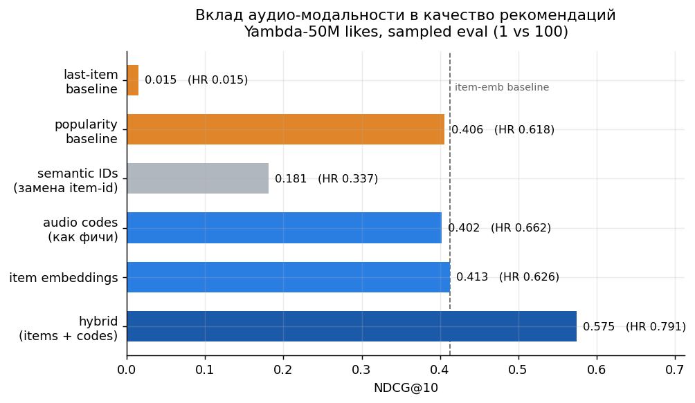
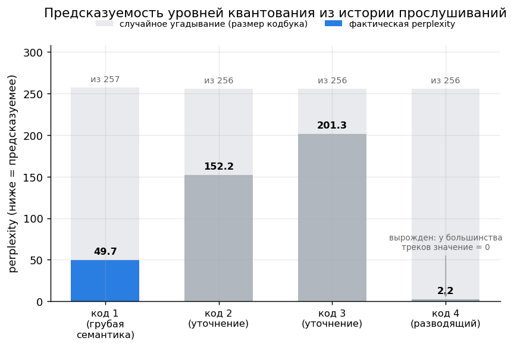
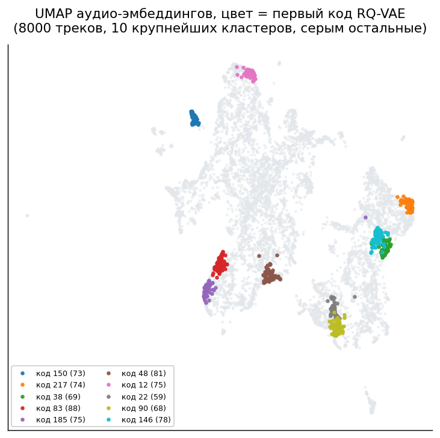

<div align="center">

# SASRec on Yandex Yambda

[](https://colab.research.google.com/github/mmmaximov/sasrec-yambda/blob/main/SASRec.ipynb)
[](https://nbviewer.org/github/mmmaximov/sasrec-yambda/blob/main/SASRec.ipynb)
[](https://opensource.org/licenses/MIT)
[](https://pytorch.org/)
[](https://huggingface.co/datasets/yandex/yambda)
[](#structure-and-how-to-run)
[](#summary-table-test-6951-users)

*A decoder-only transformer for sequential recommendation, with causal self-attention implemented from scratch. Track audio embeddings are quantized into semantic IDs via RQ-VAE: as a replacement for item embeddings they underperform, but as a supplement they lift NDCG@10 by 39%. A six-model ablation on Yandex Yambda, all runnable on a free Colab T4.*

</div>

---

## Contents

- [TL;DR](#tldr)
- [Task](#task)
- [What's where in the notebook](#whats-where-in-the-notebook)
- [Data](#data)
- [Architecture](#architecture)
  - [Track vector](#track-vector)
  - [Residual quantization](#residual-quantization)
  - [Loss function](#loss-function)
- [Results](#results)
  - [Summary table](#summary-table-test-6951-users)
  - [Validation on a held-out split](#validation-on-a-held-out-split)
  - [Contribution of each quantization level](#contribution-of-each-quantization-level)
  - [Model size](#model-size)
- [Key finding: why semantic IDs don't work as a replacement](#key-finding-why-semantic-ids-dont-work-as-a-replacement)
- [The tokenization itself is meaningful](#the-tokenization-itself-is-meaningful--thats-a-separate-question)
- [Engineering details that are easy to get wrong](#engineering-details-that-are-easy-to-get-wrong)
- [Limitations](#limitations)
- [Possible next steps](#possible-next-steps)
- [Structure and how to run](#structure-and-how-to-run)
- [References](#references)

---

## TL;DR

A recommender model typically keeps a **learnable vector per track**: 181 thousand tracks means 11.6 million parameters in the embedding table alone. This has a blind spot: the model knows nothing about a new track, because its vector hasn't been trained yet.

The idea behind semantic IDs is to **derive a track's representation from how it sounds**, rather than from listening history. An audio embedding is compressed into a tuple of a few small integers, something like `(142, 87, 231)`; the vocabulary collapses from 181K items down to 1,026 tokens, and recommendation turns into generation: the model predicts the next track code by code, the way a language model generates text.

**Result:** replacing item embeddings with codes outright **doesn't work** (NDCG@10 drops from 0.413 to 0.181, below even the popularity baseline). But using the codes **alongside** item embeddings improves quality by **39.2%** relative to the base model (0.413 → 0.575), and the gain holds on a held-out split (+40.2%).

**Beyond the headline metrics, this repo also shows:**

- the negative result **isn't left unexplained**: per-position perplexity shows that of the four codes, only the first is predictable from history (49.7 out of 257 possible), while the second and third are guessed almost at random (152.2 and 201.3 out of 256) — a consequence of RQ-VAE being optimized for audio reconstruction, not for predictability from behavior;
- a **metric bug** was caught: a trivial last-item baseline showed HitRate@10 = 1.0000, because tied scores were being ranked in its favor; after correctly splitting ties it dropped to 0.0145;
- **tokenization quality is separated from recommendation quality**: the codes meaningfully encode sound (within-cluster cosine 0.81–0.89 vs. 0.10–0.20 to unrelated tracks), and that doesn't stop the model from underperforming when trained on codes alone;
- audio embeddings for 181K tracks are extracted from a **13.8 GB file via streaming in 3.2 minutes**, with no download, using the parquet footer and row-level filtering;
- initial loss is **checked against its theoretical value** in two different setups (1.3904 vs. 1.3863 for BCE with one negative, 6.9373 vs. 6.9334 for full softmax), catching initialization bugs before training even starts;
- a **constrained beam search** over a prefix tree is implemented: generation only follows paths that correspond to real tracks.

The data is music, but nothing about the setup is music-specific: all that's needed is a sequence of interactions and a content representation of the item.

**Implemented from scratch, not from a library call:**

| Piece | What that means in practice |
|---|---|
| Causal self-attention | Q/K/V projections, masking, fully-masked-row handling — no `nn.MultiheadAttention` |
| RQ-VAE | Residual quantization, straight-through estimator, k-means codebook init |
| Constrained beam search | Custom decoding over a prefix tree of valid item paths |
| Evaluation protocol | Sampled ranking with correct tie-splitting (a naive version silently inflates scores) |

## Task

Given a user's history $[i_1, \dots, i_n]$, a time-ordered sequence of tracks, predict $i_{n+1}$.

This is **next-token prediction**, just with track IDs instead of words. Hence the GPT-style architecture: a decoder-only transformer with causal self-attention, positional embeddings, and next-element prediction for every position in a single pass.

Formally, the model produces a representation of the user's state after the $t$-th event:

$$h_t = f_\theta(i_1, \dots, i_t) \in \mathbb{R}^{d}$$

and the score of track $j$ as a candidate for position $t+1$ is the dot product with its representation:

$$s(j \mid h_t) = h_t^\top v_j$$

Everything that follows is about **how $v_j$ is obtained**. The transformer itself never changes.

## What's where in the notebook

| Component | What's applied | Section |
|---|---|---|
| Causal self-attention | Q/K/V from scratch, two masks, handling of fully-masked rows | 5 |
| Leave-last-out split | Per-user time-based split, discussion of possible leakage | 3 |
| Sampled evaluation | 1-vs-100 protocol, honest tie handling in ranking | 4 |
| Streaming parquet reads | Footer, column selection, `iter_batches` over a 13.8 GB file | 7 |
| RQ-VAE | Residual quantization, straight-through estimator, k-means init | 8 |
| Generative retrieval | Semantic IDs as a token sequence, full softmax | 9 |
| Constrained beam search | Generation over a prefix tree of valid paths | 10 |
| Ablation | Six models under one protocol, one seed | 11, 12 |

## Data

[Yandex Yambda](https://huggingface.co/datasets/yandex/yambda), the `likes` subset of the 50M version.

| Parameter | Value |
|---|---|
| Events | 881,456 |
| Users (after filtering < 5 events) | 6,951 |
| Unique tracks | 180,942 |
| History length: median / 95th percentile / max | 44 / 398 / 8,697 |
| Context window `MAX_LEN` | 100 tracks |
| Audio embeddings | 128-dim, 94.2% coverage |

Likes were used rather than listens: `listens` in this version has 46.5M events, which is more than a free Colab can comfortably handle, and the signal there is noisier (autoplay, background listening). A like is an explicit action, so the resulting sequences are cleaner.

The dataset is fully anonymized: only numeric IDs, no track titles or artist names. The only content information available is the audio embeddings, produced by a convolutional network on spectrograms.

**On missing values.** 10,474 tracks (5.8%) have no audio embedding, but they account for only 3.7% of interactions, and among the top 100 most popular tracks only one lacks audio. The gaps are skewed toward the tail, so they're assigned a dedicated first code, 256, meaning "sound unknown": for these the model learns to rely on the behavioral signal alone.

## Architecture

### Track vector

This is where the configurations diverge:

$$v_j = \underbrace{e_j}_{\text{learnable vector}} + \underbrace{\sum_{p=1}^{4} C_p\left[k_p(j)\right]}_{\text{audio-code embeddings}}$$

Both terms are toggled by flags, so three configurations ($e_j$ only, codes only, both together) come from a single class. The architecture, loss, training procedure, and evaluation protocol are otherwise identical line for line.

### Residual quantization

The audio embedding $x \in \mathbb{R}^{128}$ passes through an encoder into $z \in \mathbb{R}^{32}$, which is then quantized sequentially:

$$r_0 = z, \qquad k_p = \arg\min_{c} \left\lVert r_{p-1} - C_p[c] \right\rVert, \qquad r_p = r_{p-1} - C_p[k_p]$$

$$\hat{z} = \sum_{p=1}^{3} C_p[k_p]$$

Each subsequent codebook approximates whatever the previous one couldn't capture. Hence the hierarchy: the first code covers a coarse region of sound-space, the following ones refine it.

The $\arg\min$ operation is non-differentiable, so a **straight-through estimator** is used: the quantized value is used on the forward pass, and the gradient passes through unchanged on the backward pass, `z_q = z + (z_q - z).detach()`.

Three levels of 256 codes each give around 16.7M distinguishable combinations from a vocabulary of just 768 learnable vectors. A fourth code is added as a **tie-breaker**: within a collision group, tracks get a sequential index that carries no semantics of its own.

### Loss function

A full softmax over 181K items doesn't fit on a T4: the logits matrix for a batch of 128 with a window of 100 weighs about 9 GB. So **negative sampling** is used instead, one random negative per position, with BCE. There's no separate output layer — the same representation used on the input side is reused for scoring (weight tying).

In the generative setup the vocabulary collapses to 1,026 tokens, making a full softmax cheap. This is the main engineering payoff of tokenization, independent of its effect on metrics.

## Results

### Summary table (test, 6,951 users)

Protocol: 1 true next track against 100 random negatives, one `seed` across all models, ranking ties split evenly.

| Model | Track representation | NDCG@10 | HitRate@10 |
|---|---|---|---|
| last-item | last track in history | 0.0145 | 0.0145 |
| popularity | train-set frequency | 0.4061 | 0.6179 |
| SASRec on semantic IDs | 4 codes as a token sequence | 0.1809 | 0.3371 |
| SASRec on audio codes | same 4 codes used as track features | 0.4024 | 0.6621 |
| SASRec on item embeddings | learnable vector | 0.4130 | 0.6255 |
| **SASRec hybrid** | **vector plus codes** | **0.5750** | **0.7911** |

The hybrid beats the item-embedding model by **39.2%** on NDCG@10 and **26.5%** on HitRate@10.

The audio-codes-only configuration shows diverging metrics: slightly below popularity on NDCG (0.4024 vs. 0.4061), but noticeably above it on HitRate (0.6621 vs. 0.6179). Audio semantics pull the right track into the top 10, but don't push it to the very top positions.



### Validation on a held-out split

The hybrid has more parameters than either isolated configuration, so the gain was rechecked on val.

| Model | NDCG test | NDCG val | difference |
|---|---|---|---|
| item embeddings | 0.4130 | 0.4258 | +0.0129 |
| audio codes | 0.4024 | 0.4193 | +0.0170 |
| hybrid | 0.5750 | 0.5969 | +0.0219 |

The shift is consistent across all three models, both in sign and in magnitude. The val target sits closer to the end of the training history and is therefore somewhat easier to predict — this doesn't look like overfitting. The hybrid's gain holds on both splits, **+39.2% on test and +40.2% on val**.

The val–test gap grows with parameter count: 0.0129 for item embeddings, 0.0219 for the hybrid.

### Contribution of each quantization level

| Codes included in the score | NDCG@10 | HitRate@10 |
|---|---|---|
| first | 0.0802 | 0.2060 |
| first two | 0.0955 | 0.2228 |
| first three | 0.1279 | 0.2643 |
| all four | 0.1809 | 0.3371 |

The gain is monotonic, and even the semantics-free tie-breaker code contributes to it. So the codes aren't adding noise.

### Model size

| Model | Parameters | Of which in the representation table |
|---|---|---|
| SASRec on item embeddings | 11,686,848 | 11,580,352 (99.1%) |
| SASRec on semantic IDs | 258,306 | 65,664 (25.4%) |

The generative model is **45× lighter**. For the first, 99% of the weights go toward memorizing individual tracks; for the second, most of the budget goes to the transformer itself — what used to live in parameters is now encoded in the structure of the codes.

## 💡 Key finding: why semantic IDs don't work as a replacement

> The gap between 0.181 and 0.413 comes down to how the codes are used.
>
> **Step 1. Where the bottleneck is.** In the generative setup the model predicts four tokens per track, and a candidate's score is the sum of the log-probabilities of all four codes. One poorly predictable level is enough to drag down the whole tuple.
>
> **Step 2. Measurement.** Perplexity was computed separately for each code position:
>
> | Position | Perplexity | Codebook size | How much better than random |
> |---|---|---|---|
> | code 1 (coarse semantics) | 49.7 | 257 | 5.2× |
> | code 2 (refinement) | 152.2 | 256 | 1.7× |
> | code 3 (refinement) | 201.3 | 256 | 1.3× |
> | code 4 (tie-breaker) | 2.2 | 256 | degenerate: 0 for 82% of tracks |
>
> Only the first level is meaningfully learned. The second and third are guessed almost at random, and the fourth's low perplexity is just a skewed distribution, not real predictability.
>
> 
>
> **Step 3. Why.** RQ-VAE was trained **for audio reconstruction**: its loss is the MSE between the original vector and its reconstruction. The first level ends up encoding coarse sound category, which is inferable from behavior (listened to electronic, likely more electronic next). The lower levels encode fine acoustic details of the residual — details that simply aren't present in listening history. Tokenization was optimized for one task and used for another.

**Step 4. What this doesn't mean.** Unpredictability only hurts when the codes have to be guessed. If the same codes are instead fed in as track features, the model reads them off the candidate rather than predicting them, and weak predictability stops mattering. The audio-codes-only configuration reaches 0.4024 vs. 0.4130 for the learnable embeddings, nearly matching it with **45× fewer parameters**.

This is also what makes the hybrid work: the item embedding stores the track's behavioral history, the codes describe how it sounds, and together they give 0.5750 — more than the sum of the individual contributions.

## The tokenization itself is meaningful — that's a separate question

It's tempting to blame the codes-only model's failure on poor tokenization. That's not what's happening.



Color is the first RQ-VAE code; gray marks tracks outside the ten largest clusters (about 95% of the sample). The visual density is confirmed numerically in the original 128-dimensional space:

| Metric | Value |
|---|---|
| Within-cluster cosine | 0.809 – 0.887 |
| Cosine to unrelated tracks | 0.103 – 0.197 |
| Cosine between centroids of the nearest code pair | 0.825 |
| Median across all top-10 pairs | 0.096 |

The gap between within-cluster and between-cluster cosine spans almost an order of magnitude, so the separation isn't a projection artifact. **Where overlaps do occur, they reflect the hierarchy**: the first level slices a continuous sound-space, so neighboring regions inevitably border each other, and the nearest code pair's centroid cosine (0.825) is an order of magnitude above the median (0.096).

A reconstruction quality of 0.9272 cosine similarity (median 0.9355) means three numbers already preserve nearly all the sound information — the fourth, semantics-free level isn't needed for that.

On the projection: t-SNE with Euclidean distance tore the clusters apart on this data, because the vectors are normalized and lie on a sphere, where the appropriate distance is angular. UMAP with `metric='cosine'` gives a coherent picture.

## Engineering details that are easy to get wrong

**Extracting 93 MB from a 13.8 GB file.** Yambda's audio embeddings live in a single parquet file covering 7.72M tracks. Downloading it in Colab isn't feasible, and only 181K tracks — about 2% of the file — are actually needed. Three properties of the columnar format help here. The footer with metadata can be read with a single HTTP range request, without touching the file body. Columns can be read independently, so only `embed` (6.0 GB) is pulled instead of `normalized_embed` (8.1 GB), with normalization done locally in one line. `iter_batches` streams the file in chunks, with filtering applied on the fly, so only the needed vectors stay in memory. **3.2 minutes of streaming** vs. downloading 13.8 GB outright.

**A NaN trap in attention.** If an example's entire sequence is padding (which does happen in a batch), every key is masked for that row, softmax over all $-\infty$ produces $0/0$, and that single row poisons the whole batch through the residual connections. Without `torch.nan_to_num` after softmax, training goes to NaN on the very first step.

**Ties in ranking.** A naive count of "how many candidates strictly outrank the true item" gives the true track first place for free whenever scores are tied. For continuous scores this changes nothing, but the last-item baseline only ever outputs two values, 0 or 1, and as a result showed **HitRate@10 = 1.0000**. After splitting ties evenly (rank = "strictly above" plus half the number of ties), it dropped to 0.0145.

**Calibrating the initial loss.** A trick from Karpathy's walkthroughs: compute what the loss of an untrained model *should* be, and check it against the actual value. For BCE with one negative that's $2\ln 2 \approx 1.3863$, actual 1.3904. For full softmax over 1,026 tokens that's $\ln 1026 \approx 6.9334$, actual 6.9373. A mismatch here would point to broken initialization or incorrect padding masking, and it's caught before the first epoch even runs.

**Dead codes in RQ-VAE.** With random initialization, some codebook vectors never end up being the nearest match to anything and stop receiving gradient, so the codebooks are warmed up with k-means on real residuals first. Over training, the fraction of "live" first-level codes drops from 100% to 57% and recovers to 90%: the encoder moves away from its initialization, the old geometry falls apart, and the codebooks re-settle around the new one.

## Limitations

- **Sampled evaluation is optimistic.** Ranking against 100 negatives is easier than ranking against a catalog of 181K. Numbers are comparable across the models in this repo, but not against metrics from papers computed under a different protocol.
- **Negatives don't exclude the user's own history.** The original paper samples negatives from tracks the user hasn't interacted with; here they're sampled uniformly from the whole catalog. This bias works against the models, so the metrics here are, if anything, understated.
- **Single run, single seed.** No confidence intervals; differences in the third decimal place mean nothing.
- **Code collisions remain high.** 28.5% of tracks share their three-code semantic tuple with at least one other track, with 242 tracks in the largest group. The tie-breaker code resolves distinguishability but carries no semantics, which shows up clearly in its perplexity.
- **The code scheme depends on the global RNG state.** Running the notebook top to bottom is reproducible, but retraining RQ-VAE after other operations touch the generator will shift both the collisions and the token vocabulary size.
- **Trained only on `likes`**, 881K events instead of the 46.5M in `listens`. This is a runtime constraint, not a code limitation: switching subsets is a single loading argument.
- **Window of 100 tracks.** Attention is $O(L^2)$, and in the generative setup a track occupies 4 positions. Three-quarters of users fit entirely within the window; the rest have their history truncated.

## Possible next steps

**Train RQ-VAE for predictability rather than reconstruction.** Optimizing the quantizer jointly with the recommender would push the lower levels to encode things inferable from behavior rather than fine acoustic detail. The pipeline would then become end-to-end instead of two-stage.

**Bring in `artist_id` and `album_id`.** Both are available in Yambda and would almost certainly add signal — especially for the 5.8% of tracks that have no audio and are currently served by a placeholder code.

**More negatives per position.** Currently one, as in the original paper. In-batch negatives or a sampled softmax with $k \gg 1$ typically improve quality without any architectural changes.

**A run on `listens`.** 46.5M events and a vocabulary of roughly a million items — the setting where the generative setup's small output layer finally pays off.

## Structure and how to run

```
sasrec-yambda/
├── SASRec.ipynb           # the whole project, 12 sections
├── README.md
├── LICENSE
├── .gitignore
└── assets/
    ├── umap.png           # RQ-VAE code clusters (section 8)
    ├── ablation.png       # summary model comparison (section 12)
    └── perplexity.png     # predictability of quantization levels (section 12)
```


**Running it.** Open the notebook in Colab via the badge above, enable a GPU (`Runtime → Change runtime type → T4 GPU`), and run `Run all`. Data downloads automatically from HuggingFace; no account needed.

**Environment.** A free Colab T4 (16 GB) is enough. `datasets`, `pyarrow`, and `umap-learn` are installed on top; everything else is pre-installed.

**Time.** A full run takes about 15 minutes: extracting audio embeddings (~3 min), RQ-VAE (~1 min), four training runs (~3 min total), evaluating semantic IDs (~3 min), the rest is fast.

**Checkpoints.** Written to Google Drive after every epoch along with optimizer state, so a dropped Colab session doesn't mean starting over. The data split, extracted embeddings, and codes are cached there too. If RQ-VAE has been retrained, old weights will be incompatible with the new code scheme — for that case, the Setup section has a `RESET_CHECKPOINTS` flag.

## References

- Kang & McAuley. **Self-Attentive Sequential Recommendation (SASRec).** ICDM 2018, [arXiv:1808.09781](https://arxiv.org/abs/1808.09781)
- Rajput et al. **Recommender Systems with Generative Retrieval (TIGER).** NeurIPS 2023, [arXiv:2305.05065](https://arxiv.org/abs/2305.05065)
- van den Oord et al. **Neural Discrete Representation Learning (VQ-VAE).** NeurIPS 2017, [arXiv:1711.00937](https://arxiv.org/abs/1711.00937)
- Yandex Yambda: [huggingface.co/datasets/yandex/yambda](https://huggingface.co/datasets/yandex/yambda)
- Andrej Karpathy. **Let's build GPT: from scratch, in code, spelled out.** [YouTube](https://www.youtube.com/watch?v=kCc8FmEb1nY)
